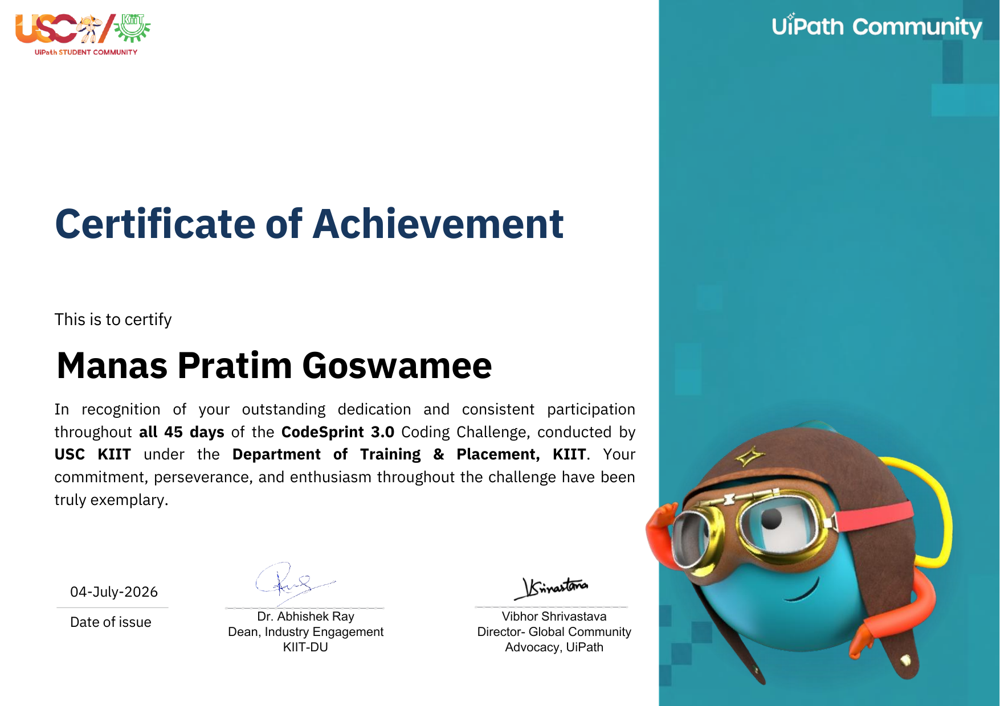

# CodeSprint 3.0 — USC KIIT 

Solutions to all 45 days of **CodeSprint 3.0**, a daily coding challenge organized by the **USC KIIT Society** under the **Department of Training & Placement, KIIT**.


---

## 📌 About

This repository documents my journey through **CodeSprint 3.0**, a 45-day competitive programming challenge covering data structures, algorithms, and problem-solving patterns commonly seen in technical interviews and coding contests. Each folder contains that day's problem statement (where applicable) and its corresponding C++ solution.

## 🗂️ Repository Structure

Each day's work is organized in its own dated folder, containing the two problems solved that day along with screenshots of their accepted submissions:

```
YYYY-MM-DD_DAY_N/
├── Q1.cpp
├── Q2.cpp
├── SC1.png
└── SC2.png
```

For example:

```
CodeSprint_3.0_USC_KIIT_CPP/
├── 2026-05-18_DAY_1/
│   ├── Q1.cpp
│   ├── Q2.cpp
│   ├── SC1.png
│   └── SC2.png
├── 2026-05-19_DAY_2/
│   ├── Q1.cpp
│   ├── Q2.cpp
│   ├── SC1.png
│   └── SC2.png
├── ...
└── 2026-07-01_DAY_45/
    ├── Q1.cpp
    ├── Q2.cpp
    ├── SC1.png
    └── SC2.png
```

All 45 folders are present, spanning the full duration of the challenge from **May 18, 2026** to **July 1, 2026**, with two problems (Q1 and Q2) solved per day.

## 🛠️ Tech Stack

- **Language:** C++
- **Paradigms covered:** Arrays, Strings, DP, Greedy, Graphs, Trees, Sorting & Searching, and more (varies by day)

## ▶️ Running a Solution

Each problem is a self-contained `.cpp` file. To compile and run a specific day's solution:

```bash
g++ -std=c++17 -O2 -o Q1 Q1.cpp
./Q1
```

## 🏆 Certificate of Achievement

Awarded for consistent participation across all 45 days of the challenge.



> Issued by USC KIIT and the Department of Training & Placement, KIIT — signed by Dr. Abhishek Ray (Dean, Industry Engagement, KIIT-DU) and Vibhor Shrivastava (Director, Global Community Advocacy, UiPath).

## 👤 Author

**Manas Pratim Goswamee**
Computer Science Undergraduate, KIIT University
GitHub: [@ManasPG](https://github.com/ManasPG)

## 📄 License

This repository is for educational and personal reference purposes.
